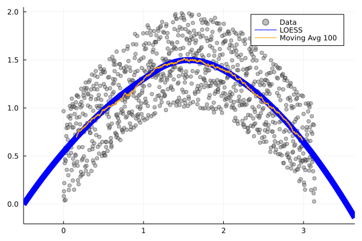
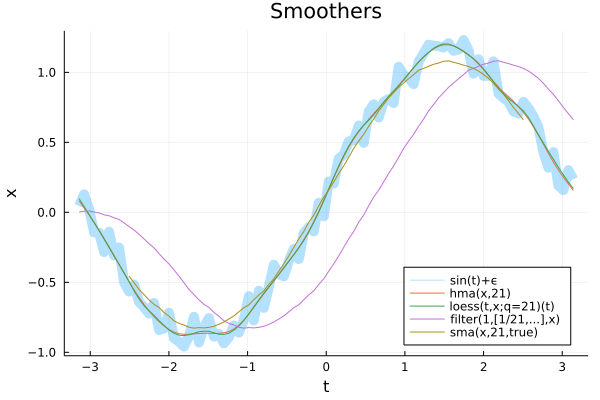

# Smoothers

The package Smoothers provides a collection of smoothing heuristics, models and smoothing related applications. The current available smoothers and applications are:

* Henderson Moving Average Filter (**hma**)
* Linear Time-invariant Difference Equation Filter (**filter**)
* Locally Estimated Scatterplot Smoothing (**loess**)
* Seasonal and Trend decomposition based on Loess (**stl**) 
* Simple Moving Average (**sma**)



## Quick Examples

```julia  
using Smoothers, Plots

t = Array(LinRange(-pi,pi,100));
x = sin.(t) .+ 0.25*rand(length(t));

# Data
w = 21
plot(t,x,label="sin(t)",linewidth=10,alpha=.3,
     title="w="*string(w),legend=:bottomright)

# Henderson Moving Average Filter
plot!(t,hma(x,w), label ="hma(x,w)")

# Locally Estimated Scatterplot Smoothing
plot!(t,loess(t,x;q=w)(t), label ="loess(t,x;q=w)(t)")

# Moving Average Filter with Matlab/Octave 'filter'
b = ones(w)/w; a = [1];
plot!(t,filter(b,a,x), label ="filter(1,[1/w,...],x)")

# Simple Moving Average
plot!(t, sma(x,w,true), label = "sma(x,w,true)")
```


## References

* [Cleveland et al. 1990]  Cleveland,  R.  B.;  Cleveland,  W.  S.;McRae, J. E.; and Terpenning, I.  1990.  STL: A seasonal-trend decomposition procedure based on loess. Journal of Official Statistics 6(1):3–73.
* Henderson, R. (1916). Note on graduation by adjusted average. Transactions of the Actuarial Society of America, 17:43-48. [Australian Bureau of Statistics: What Are Henderson Moving Averages?](https://www.abs.gov.au/websitedbs/d3310114.nsf/4a256353001af3ed4b2562bb00121564/5fc845406def2c3dca256ce100188f8e!OpenDocument#:~:text=WHAT%20ARE%20HENDERSON%20MOVING%20AVERAGES%3F)
* Octave Forge: [filter function](https://octave.sourceforge.io/octave/function/filter.html)

[](https://github.com/viraltux/Smoothers.jl/actions)
[](https://codecov.io/gh/viraltux/Smoothers.jl)
